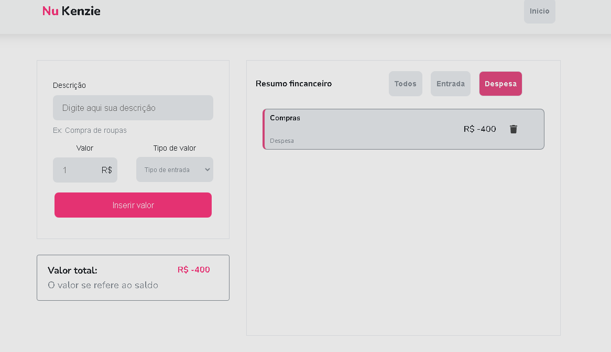

# Finances Control
# Sobre o projeto
<a href="https://react-entrega-s1-nu-kenzie-cesarrafaeljunior.vercel.app/">Visualizar projeto</a>
Finances control é um projeto simples e acadêmico, o aplicativo simula um gerenciamento de finanças, permitindo o usuário cadastrar entradas e saídas de dinheiro. 
O cálculo de entradas e saídas acontece dinamicamente.
###OBS: A plicação não salva as informações

# Layout do projeto
## Página Inicial

## Dashboard

# Tecnologias utilizadas
- HTML/CSS/JavaScript
- React

# Implantação em produção
- Vercel

# Autor
César Rafael da Silva Júnior
Linkedin => https://www.linkedin.com/in/cesarrafaeljunior/
